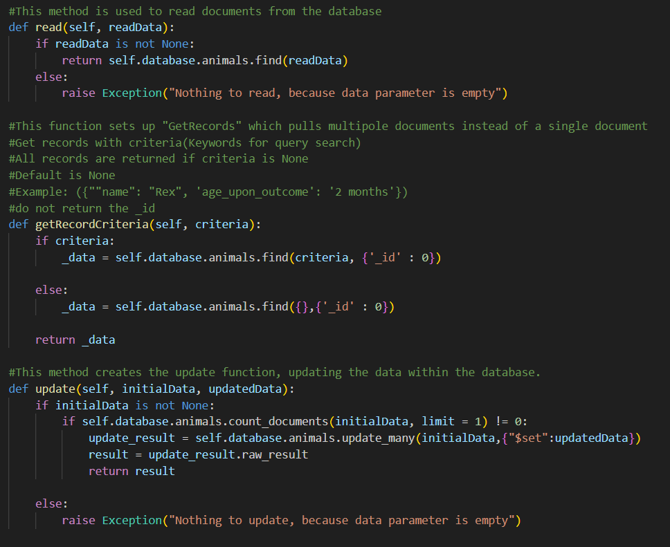
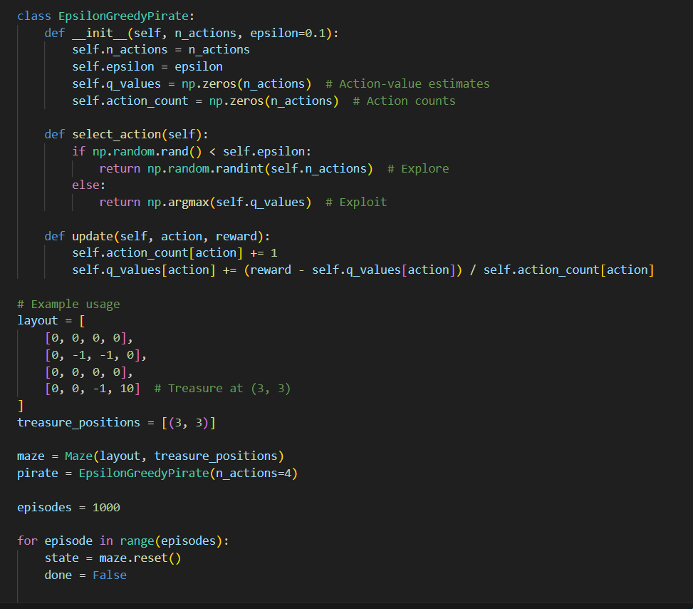
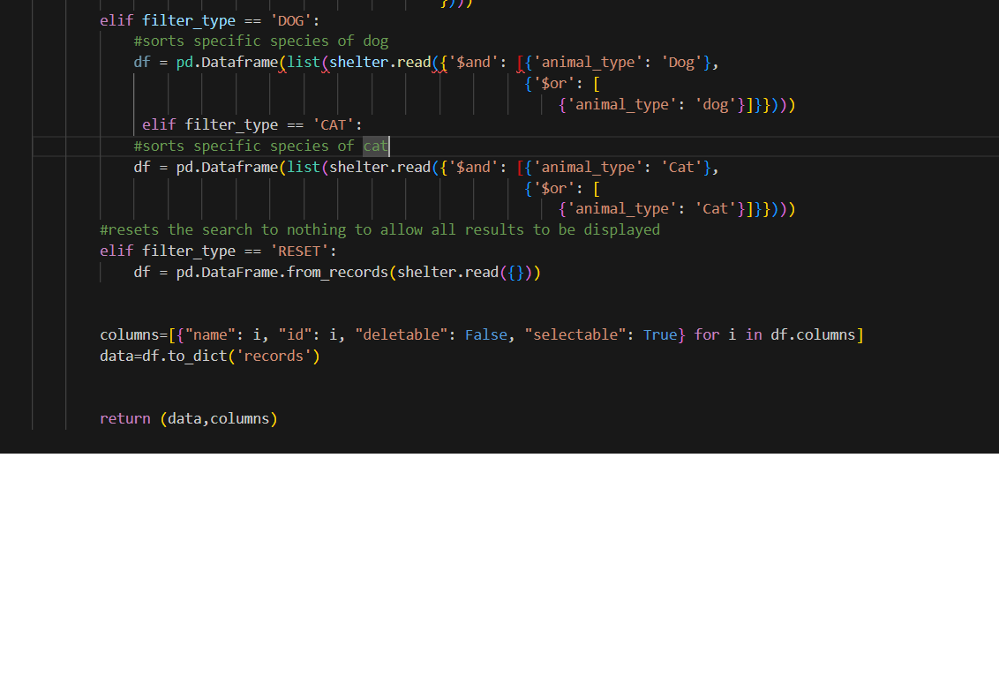

&nbsp;&nbsp;

### Welcome

This ePortfolio is a reflection of my abilities and knowledge that I have harnessed and continue to improve throughout my time with Southern New Hampshire University. At my time at SNHU, I have been recognized on 10 separate occasions on the Honor Roll and 2 times on the deans list, for maintaining at minimum a 3.5 gpa during each respective term and semester. This has lead me to gain the honor of 'Cum Laude' in this chosen degree field. As this is a culmination of my undergraduate work, this portfolio will showcase my technical prowess in tandem to the unique set of soft skills. 

### <u>Professional Self-Assessment</u>

I started my collegiate journey at SNHU in June of 2022, I had completed my general education requirements years prior at Morehead State University in 2012 and American Public University in 2015. From there I had changed my major a multitude of times, dipping my toes in the water so to speak. I fell in love with programming and scripting during my time in the course IT-140. It amazed me how much you can accomplish with a few lines of code, from video games to medical equipment, we as a society have never been more intertwined with technology and I absolutely adore living in this timelime. I started my coding journey by learning Python, Java, and C++. Growing from there, I learned skills within the Software Development Lifecycle and Team Collaboration, even delving into more complex topics such as computational graphic visualization and full-stack development. As a teen and young adult, what deterred me was a fear of not understanding the deep level of mathematics behind a Computer Science degree, which I have conquered with ease in terms of Calculus, Discrete Mathematics, Applied Linear Algebra, and Statistics. My tenure at SNHU has left me feeling eager and well rounded. Within the following sections, I will demonstrate my understanding of my chosen coding artifacts I have completed while attending the Computer Science undergraduate Program at SNHU through the use of my two chosen artifacts. 

The artifacts I have chosen accentuate my understanding of appropriate software design such as helpful naming conventions and appropriate commenting, algorithms and data structures through my understanding of q-learning and greedy-epsilon reinforcement algorithms, and mastery of understanding of CRUD methodologies along side the understanding of simple and complex query searches within MongoDB. 

Below is a table that showcases a few technical and soft skills I have obtained during my tenure at SNHU and during my personal professional development. 

<table>
<tr>
    <th><b>Technical Skills</b></th>
    <th><b>Soft Skills</b></th>
</tr>
<tr>
    <td>Python</td>
    <td>Adaptability</td>
</tr>
<tr>
    <td>Java</td>
    <td>Customer/Client Networking</td>
</tr>
<tr>
    <td>C++</td>
    <td>Managerial Experiences</td>
</tr>
<tr>
    <td>Software Development Lifecycle</td>
    <td>Interpersonal Communication</td>
</tr>
<tr>
    <td>Full-Stack Development </td>
    <td></td>
</tr>
<tr>
    <td>Computational Graphic Visualization</td>
</tr>
<tr>
    <td>Operation Platforms</td>
    <td></td>
</tr>
<tr>
    <td>Artificial Intelligence and Machine-Learning Algorithms</td>
    <td></td>
</tr>
</table>

### <u>Code Review</u>

<iframe width="720" height="480" style="border:0;" scrolling="no" src="https://go.screenpal.com/player/cZ62fUVWxOS?controls=1&share=1&download=1&embed=1&cl=1&width=1280&height=720&overlays=1&ff=1" allowfullscreen="true"></iframe>

### <u>Artifact One: Sofware Design and Engineering </u>

This artifact was created originally during my coursework for the course CS 340, Client/Server Development. The goal here was to create a web-based application in order to help search through a MongoDB-based database for an animal shelter. Here we had to design a python document, this python document has been programmed to connect to the specific database attached to this project. Here we created a base of Four operations representing a CRUD method of searching, CRUD standing for Create, Read, Update, and Delete. This gives our web-based dashboard the abilities to create documents and add them to the database, retrieve and read documents from the database, update documents within the database and delete documents from the database. 

I chose this artifact for this category to ultimately show my understanding of software design, how the different classes mesh together and how naming convention and comments are ever important parts of the design process, to help for future maintenance that may be done by a different developer who may not completely understand what my mindset was when developing the program. It creates an easy reading experience for easy understanding. 

Within the original artifact, I recognize the lack of naming convention with mutiple argument variables being named 'data', my update to these were mainly in the realm of design, to help clarify what data was going for what CRUD method. 

Below is a hyperlink to the full repository for artifact one. 

<a href="https://github.com/J-Sparks-93/J-Sparks-93.github.io/tree/main/CS-Program-SNHU-CS-340/CS-Program-SNHU-CS-340">Artifact One Repository Branch</a>

### <u> Artifact Two: Algorithm and Data Structures </u>

This artifact was created during my coursework with CS 370, Emerging Trends in Computer Science. This course focused on Artificial Intelligence and Machine-learning algorithms. We were to develop a Q-Learning algorithm to help guide a pirate, which is acting as our intelligent agent, through a predefined maze, through multi-episodal epochs, to obtain a successful completion rate of at least 90%, completion being represented by the pirate successfully navigating the maze to obtain the treasure. 

I included this artifact as it shows my understanding of multiple machine-learning algorithms and how they work to train the intelligent agent in terms of its environment. The updates I made to this are within a separate document entitled "EpsilonGreedySolution" within the repository. I created an alternative epsilon-greedy solution to the pirate problem. The basis of an epsilon-greedy solution is to balance the agents exploration and exploitation factors within the algorithm, which over time limits the amount of exploration the agent can take, relying more on exploiting the knowledge it has gained from past epochs. 

Below is a hyperlink to the full repsoitory for artifact two.

<a href="https://github.com/J-Sparks-93/J-Sparks-93.github.io/tree/main/CS-Program-SNHU-CS-370/CS-Program-SNHU-CS-370">Artifact Two Repository Branch</a>

### <u>Artifact Three: Databases</u>

Here, we will be revisiting Artifact One, from CS 340 Client/Server Development. As stated previously this project was based on the creation of a web-based dashboard program to ease the burden of access to the information on the database for the workers within the animal shelter. Here within jupyter notebook, we continued to access the database using python elements while designing the dashboard with HTML elements. The base project was required to have four filters to search for specific keyword elements to complete complex query searches within the database, based on specific breed requirements. As it stands, the program functions in a way that if no keywords are used in a search, all records will be returned, if a filter is added, it will select only the documents that has the keyword elements within. 

I included this artifact for this category as it fits perfect with the theme of showing I understand database queries, simple and complex in terms of this project. My updates here include adding two additional filters for two simple queries. As this database is connected to an animal shelter, it made only sense that a user may need to access documents pertaining to only specific species of animals, so I added two additional filters, one specifically for cats, the other for dogs. 

Below is a hyperlink to the full repsoitory for artifact three.

<a href="https://github.com/J-Sparks-93/J-Sparks-93.github.io/tree/main/CS-Program-SNHU-CS-340/CS-Program-SNHU-CS-340">Artifact Three Repository Branch</a>

